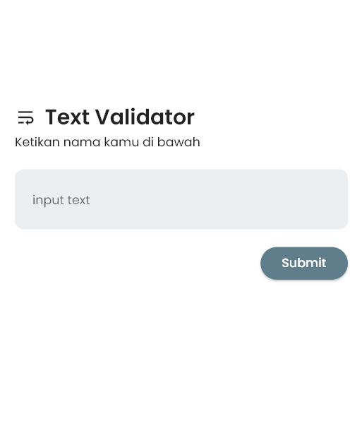
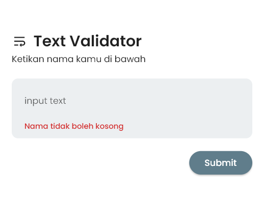
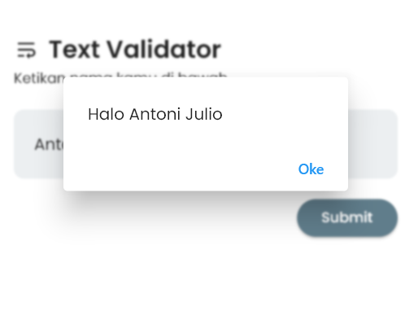

## FLUTTER FORM VALIDATION

Using `TextEditingController` as text controller.

- The name must not be empty.
- The name must not contain special characters.
- The name must not contain numbers.
- The name must not start with a space.
- The name must start with a capital letter.
- The name must not exceed 20 characters.
- The name must contain a minimum of 4 characters.

### Demo

